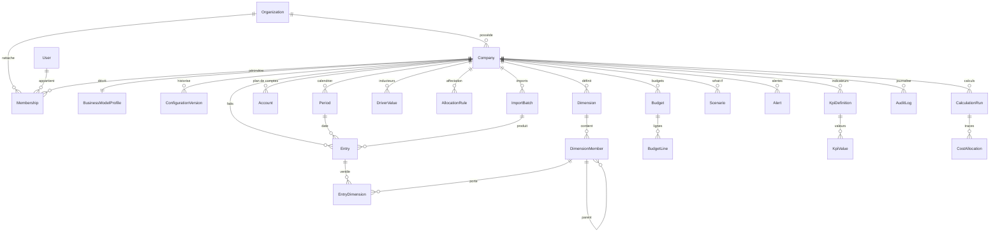

# 04 — Schéma de base de données

Le schéma exécutable est `prisma/schema.prisma`. Ce document en donne la vue logique, les index
et les règles de portabilité.

## 1. Diagramme entité-relation

## 2. Tables et clés

| Table | Clé primaire | Index principaux | Volumétrie attendue |
|---|---|---|---|
| `Organization` | `id` | `slug` unique | 10³ |
| `User` | `id` | `email` unique | 10⁴ |
| `Membership` | `id` | `(userId, companyId)` unique | 10⁵ |
| `Company` | `id` | `(organizationId, slug)` unique | 10⁴ |
| `BusinessModelProfile` | `companyId` | — | 1 par entreprise |
| `ConfigurationVersion` | `id` | `(companyId, version)` unique | 10² par entreprise |
| `Dimension` | `id` | `(companyId, code)` unique | 10 par entreprise |
| `DimensionMember` | `id` | `(dimensionId, code)` unique, `parentId` | 10⁴ |
| `Account` | `id` | `(companyId, number)` unique | 10³ |
| `Period` | `id` | `(companyId, code)` unique | 10² |
| `Entry` | `id` | `(companyId, periodId, kind)`, `importBatchId` | **10⁵–10⁶** |
| `EntryDimension` | `id` | `(entryId)`, `(memberId)`, `(dimensionId, memberId)` | 3 × Entry |
| `DriverValue` | `id` | `(companyId, periodId, driverCode)` | 10⁵ |
| `AllocationRule` | `id` | `(companyId, stage, sortOrder)` | 10¹ |
| `Budget` | `id` | `(companyId, fiscalYear, kind, version)` | 10² |
| `BudgetLine` | `id` | `(budgetId, periodId)` | 10⁵ |
| `KpiDefinition` | `id` | `(companyId, code)` unique | 10² |
| `KpiValue` | `id` | `(kpiId, periodId, memberId)` unique | 10⁵ |
| `CalculationRun` | `id` | `(companyId, periodId)`, `fingerprint` | 10³ |
| `CostAllocation` | `id` | `(runId)`, `(targetMemberId)` | 10⁵ |
| `Scenario` | `id` | `companyId` | 10² |
| `Alert` | `id` | `(companyId, status, severity)` | 10³ |
| `ImportBatch` | `id` | `companyId` | 10² |
| `AuditLog` | `id` | `(companyId, createdAt)` | 10⁵ |

## 3. Colonnes JSON (portables)

Six colonnes stockent du JSON sous forme de `String`, validées par Zod à la lecture :

| Table.colonne | Schéma Zod | Contenu |
|---|---|---|
| `BusinessModelProfile.payload` | `businessModelProfileSchema` | le profil complet |
| `ConfigurationVersion.payload` | `configurationPayloadSchema` | capacités, dimensions, cockpit, trace |
| `DimensionMember.attributes` | `record(string, unknown)` | attributs sectoriels |
| `AllocationRule.definition` | `allocationRuleSchema` | filtre source, méthode, driver, poids |
| `BudgetLine.dimensions` | `record(string, string)` | ventilation `{PROJECT: "ALBA"}` |
| `Scenario.definition` | `scenarioSchema` | leviers what-if |
| `Alert.payload` / `KpiDefinition.meta` | schémas dédiés | détails structurés |

Passage à PostgreSQL : `String` → `Jsonb`, `parseJson()` devient l'identité. Aucun autre impact.

## 4. Règles de portabilité appliquées

1. **Pas d'`enum` Prisma** — SQLite ne les supporte pas. Les valeurs autorisées vivent dans
   `core/model/enums.ts` (unions TypeScript + `z.enum`), et sont contrôlées à l'écriture.
2. **Pas de `Json` Prisma** — cf. §3.
3. **Pas de `@db.Decimal` en dev** — `Float` + arrondi explicite `round2()` sur toute sortie
   monétaire. En production, migration vers `Decimal(18,4)`.
4. **Pas de contrainte différée ni de `ON DELETE SET NULL` exotique** — cascades simples.
5. **Identifiants** : `cuid()` (portables, triables, non devinables).

## 5. Suppression et rétention

| Entité | Politique |
|---|---|
| `Company` | suppression logique (`archivedAt`), purge manuelle après 90 j |
| `Entry` | supprimable **par lot d'import** uniquement (annulation d'import) |
| `Budget` approuvé | non supprimable, archivable |
| `ConfigurationVersion` | jamais supprimée |
| `AuditLog` | conservation 3 ans |

## 6. Empreinte de calcul (`fingerprint`)

`CalculationRun.fingerprint = sha256(companyId | periodIds | maxEntryUpdatedAt | entryCount |
allocationRulesHash | configVersion)`.

Si l'empreinte est inchangée, le résultat en cache est réutilisé : c'est la garantie que le
cockpit, le rapport et le copilote lisent **exactement** les mêmes chiffres.
